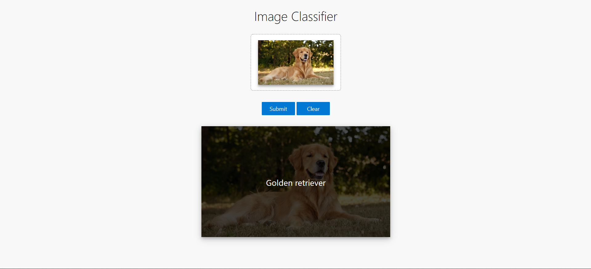
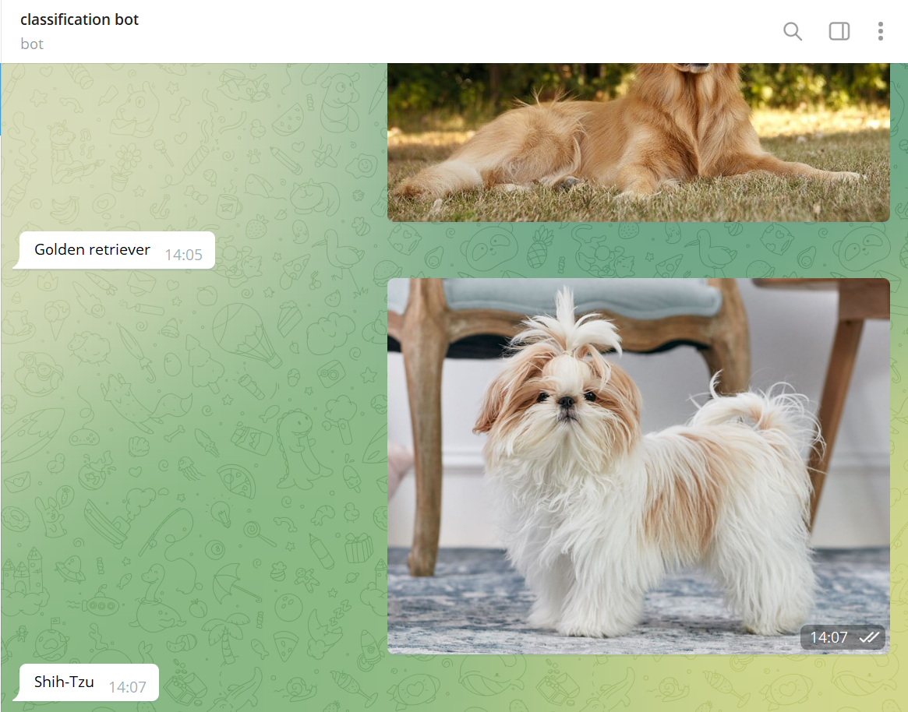

# cv-pipeline
Image woof classification
Arch: XResNet50 + Mish + MaxBlurPool + SA

# Running Flask app with Docker #
``` 
git clone git@github.com:jzus19/cv-pipeline.git
```
```
docker-compose up
```
```
docker run -it -p 5000:5000 cv-pipeline_flask 
```

* Flask Interface 



# Telegram bot # 
* https://t.me/imagewoof_classificator_bot

* Telegram Interface
